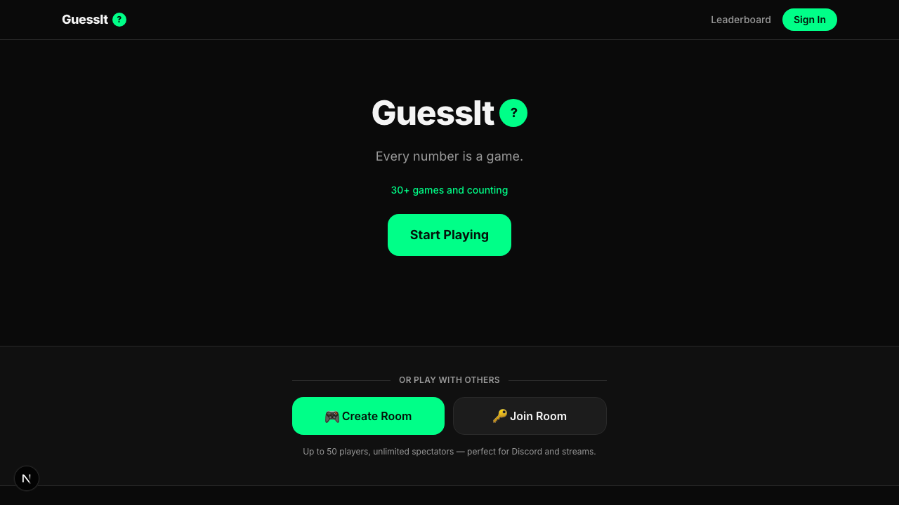
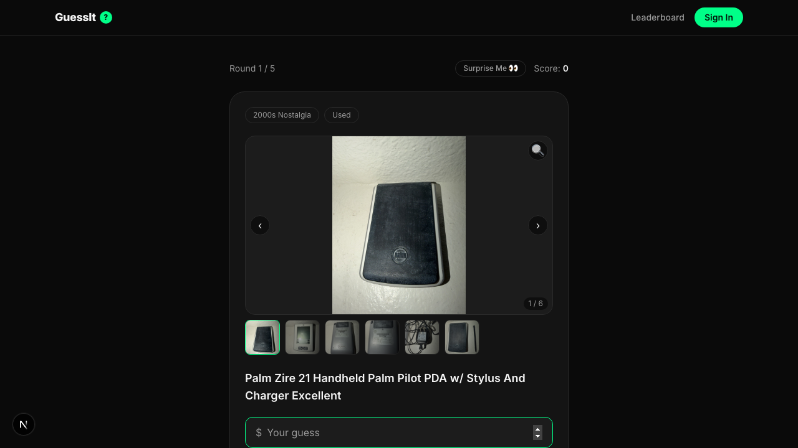
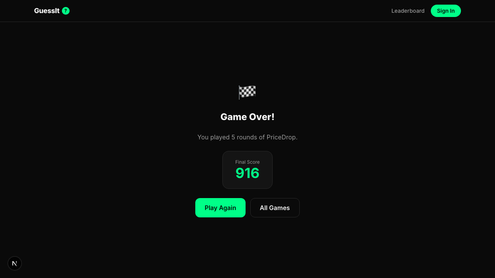

<div align="center">

# GuessIt 

**Every number is a game.**

Guess the price of an eBay listing, a country's population, a mountain's height, or how long a whale can live.
Play solo for the leaderboard, or open a room and play live with up to 50 friends.

[](https://github.com/myigitkorkmaz/guessit/actions/workflows/ci.yml)




</div>

---

## Contents

- [Features](#features)
- [Games](#games)
- [Scoring](#scoring)
- [Tech stack](#tech-stack)
- [Getting started](#getting-started)
- [Project structure](#project-structure)
- [Adding a game](#adding-a-game)
- [Data sources and attribution](#data-sources-and-attribution)

## Features

- **22 live games** across prices, geography, history, science, sports and entertainment, plus more on the way.
- **Multiplayer rooms.** Create a room, share the code, and play in real time with up to 50 players and unlimited spectators. It works well on Discord and streams.
- **Global leaderboard** with Supabase auth.
- **One scoring model.** Every game uses the same scoring curve, so a "Perfect!" means the same thing in every game.
- **Learn something.** After each round, a Wikipedia panel explains the answer.

<p align="center">
  
  
</p>

## Games

| Category | Game | Guess the… |
| --- | --- | --- |
| 💰 Prices | **PriceDrop** | price of a random eBay listing |
| | **Rent Check** | average 1-bedroom rent in a city |
| | **Net Worth** | Forbes net worth of a billionaire or celebrity |
| | **Lawsuit Lottery** | settlement or fine a company paid |
| | **Wine Vault** | price per bottle of a famous wine |
| | **Price Per Night** | average hotel price in a U.S. city |
| | **Minimum Wage** | hourly minimum wage of a country (USD) |
| 🌍 Geography | **Population Guess** | population of a country, shown on an interactive map |
| | **How Big** | area of a country, from its outline |
| | **Border Count** | number of countries a country borders |
| | **How Far** | distance between two countries |
| | **How Tall** | height of a mountain |
| | **River Length** | length of a famous river |
| 🏛️ History | **How Long To Build** | years a landmark took to build |
| | **Discovered When** | year of an invention or discovery |
| | **How Old Is It** | age of a monument |
| 🔬 Science | **Lifespan** | longest recorded lifespan of an animal |
| | **World Record** | number behind a Guinness World Record |
| | **Calorie Count** | calories in a meal or food item |
| 🏟️ Sports | **Stadium Seats** | seating capacity of a venue |
| 🎬 Entertainment | **Episode Count** | total episodes of a TV show |
| | **Budget Buster** | production budget of a movie |

All games, including the ones that are coming soon, are registered in [`lib/games.ts`](lib/games.ts).

## Scoring

Most games use GeoGuessr-style exponential scoring based on how far off your guess is, as a percentage:

```
points = max(1, round(1000 · e^(−percentOff / 30)))
```

| Off by | Label |
| --- | --- |
| ≤ 5% | 🥇 Perfect! |
| ≤ 15% | 🟢 Great! |
| ≤ 30% | 🟡 Good |
| ≤ 50% | 🟠 Close... |
| > 50% | 🔴 Miss! |

Some answers are small numbers or can be zero, such as border counts or years. Percentages don't work well for those, so those games score by absolute difference with thresholds set per game. See [`lib/scoring.ts`](lib/scoring.ts).

## Tech stack

| Layer | Choice |
| --- | --- |
| Framework | [Next.js 16](https://nextjs.org) (App Router, route handlers, `proxy.ts`) |
| UI | React 19, Tailwind CSS 4, [react-simple-maps](https://www.react-simple-maps.io/) |
| Auth and DB | [Supabase](https://supabase.com) (Postgres, Auth, Realtime broadcast for rooms) |
| Hosting | Vercel |
| Testing | Playwright end-to-end scripts |

## Getting started

### Prerequisites

- Node.js 20 or later
- A Supabase project (the free tier is enough)

### 1. Install

```bash
git clone https://github.com/myigitkorkmaz/guessit.git
cd guessit
npm install
```

### 2. Configure environment

```bash
cp .env.example .env.local
```

| Variable | Required for |
| --- | --- |
| `NEXT_PUBLIC_SUPABASE_URL`, `NEXT_PUBLIC_SUPABASE_ANON_KEY` | Everything that uses auth or the database |
| `SUPABASE_SERVICE_ROLE_KEY` | Multiplayer room API routes (server only) |
| `EBAY_PROD_APP_ID`, `EBAY_PROD_CERT_ID`, `EBAY_VERIFICATION_TOKEN` | PriceDrop |
| `TMDB_API_KEY`, `USDA_API_KEY`, `REST_COUNTRIES_API_KEY` | Refreshing the static datasets only |

### 3. Set up the database

In the Supabase SQL editor, run these files in order:

1. [`supabase/schema.sql`](supabase/schema.sql): profiles and global scores
2. [`supabase/multiplayer-schema.sql`](supabase/multiplayer-schema.sql): rooms, participants, rounds and guesses

### 4. Run

```bash
npm run dev        # http://localhost:3000
```

| Script | What it does |
| --- | --- |
| `npm run dev` | Start the dev server |
| `npm run build` | Build for production |
| `npm run start` | Serve the production build |
| `npm run lint` | Run ESLint |
| `npm run typecheck` | Run the TypeScript compiler without emitting |

## Project structure

```
app/
  games/<id>/page.tsx      one page per game
  api/<id>/random/         route handler that serves a random round
  api/room/[code]/…        multiplayer room lifecycle (start, next, reveal)
  room/                    create, join, and play rooms
  leaderboard/             global leaderboard
components/                shared UI (WikipediaPanel, YearSlider, WorldMap, multiplayer/)
lib/
  games.ts                 game registry (single source of truth)
  scoring.ts               shared scoring
  data/                    static dataset snapshots
  <game>.ts                per-game round logic
supabase/                  SQL schema and CLI config
types/                     shared TypeScript types
```

## Adding a game

1. Add a static dataset to `lib/data/<game>.ts`, and put the round-picking logic in `lib/<game>.ts`.
2. Add a route handler at `app/api/<game>/random/route.ts`.
3. Build the page at `app/games/<game>/page.tsx`. Copying an existing game with the same answer type is the fastest way to start.
4. Register the game in [`lib/games.ts`](lib/games.ts) with `status: "live"`.
5. Run `npm run lint && npm run typecheck` before you open a PR.

## Data sources and attribution

Most games ship **static snapshots** of their datasets. At runtime, only PriceDrop calls a live third-party API (eBay). The snapshots come from:

- [Wikidata](https://www.wikidata.org) (CC0) and [Wikipedia](https://www.wikipedia.org) (CC BY-SA). Images come from Wikimedia Commons under their individual licenses.
- [REST Countries](https://restcountries.com)
- [USDA FoodData Central](https://fdc.nal.usda.gov)
- [eBay Browse API](https://developer.ebay.com/api-docs/buy/browse/overview.html)
-  This product uses the TMDB API but is not endorsed or certified by TMDB.
- Curated figures (rent, wine prices, settlements, minimum wages, world records), each checked against public sources.
